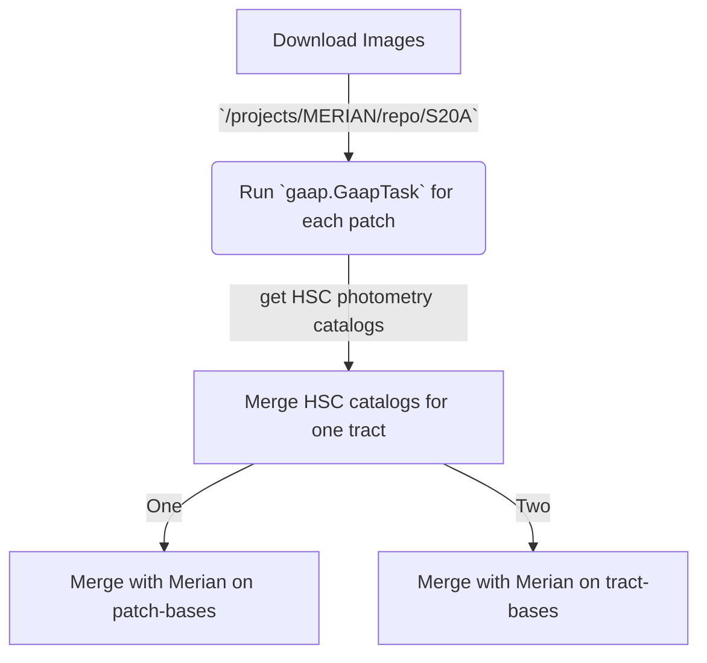

The [flow](https://mermaid.live/edit) of running `gaap` on HSC S20A data

Some questions to be answered/solved:

Technically:
- [ ] How to run the stand-alone `gaap` in parallel using `slurm` or `BPS`?
- [ ] Need to write a pipeline to download HSC S20A images and run `gaap` on them.
- [ ] Computation time: 70k CPU hours for Merian DR1. 
- [ ] Figure out why some patches don't cooperate. Maybe kill a certain band when the runtime exceeds some threshold?

Scientifically:
- [ ] What's the best aperture for dwarf galaxies? We need to do some more experiments.
- [ ] What's the difference between the default deblender and `scarlet`, and how does it affect the `gaap` results? Which one is better?
